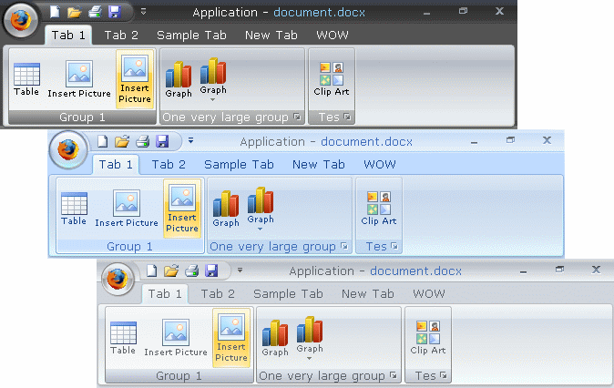



## Office 2007 Ribbon

### Description

-- Update on 10/10/06 -- This Control, will put a Office 2007 Ribbon to your application. No OCX, No DLL, No Office 2007 Required! ALL in your EXE! &gt;&gt;&gt; This Code is under Construction!! &lt;&lt;&lt;
 
### More Info
 

             |
---                |---
**Submitted On**   |2006-10-10 11:00:02
**By**             |[Adriano Paladini](https://github.com/Planet-Source-Code/PSCIndex/blob/master/ByAuthor/adriano-paladini.md)
**Level**          |Beginner
**User Rating**    |4.9 (457 globes from 93 users)
**Compatibility**  |VB 6\.0
**Category**       |[Custom Controls/ Forms/  Menus](https://github.com/Planet-Source-Code/PSCIndex/blob/master/ByCategory/custom-controls-forms-menus__1-4.md)
**World**          |[Visual Basic](https://github.com/Planet-Source-Code/PSCIndex/blob/master/ByWorld/visual-basic.md)
**Archive File**   |[Office\_20020242310102006\.zip](https://github.com/Planet-Source-Code/adriano-paladini-office-2007-ribbon__1-66698/archive/master.zip)

